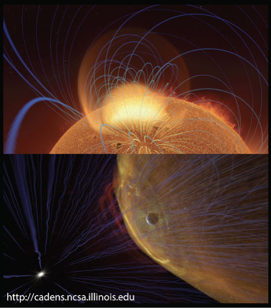
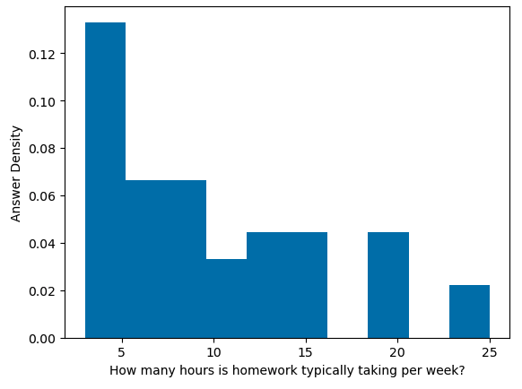
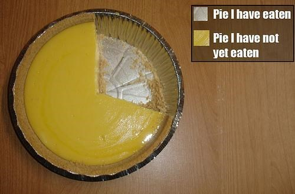
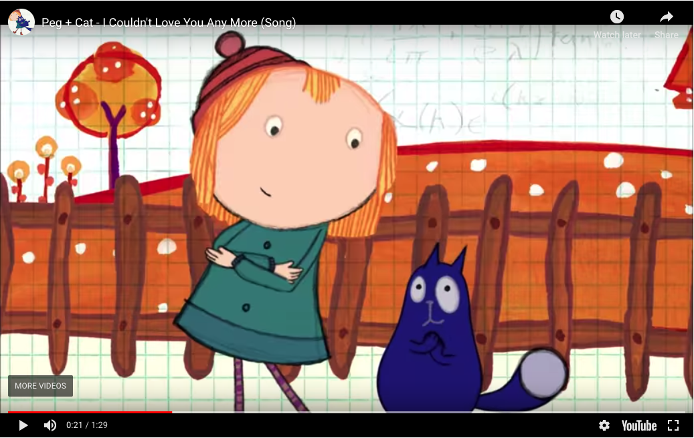
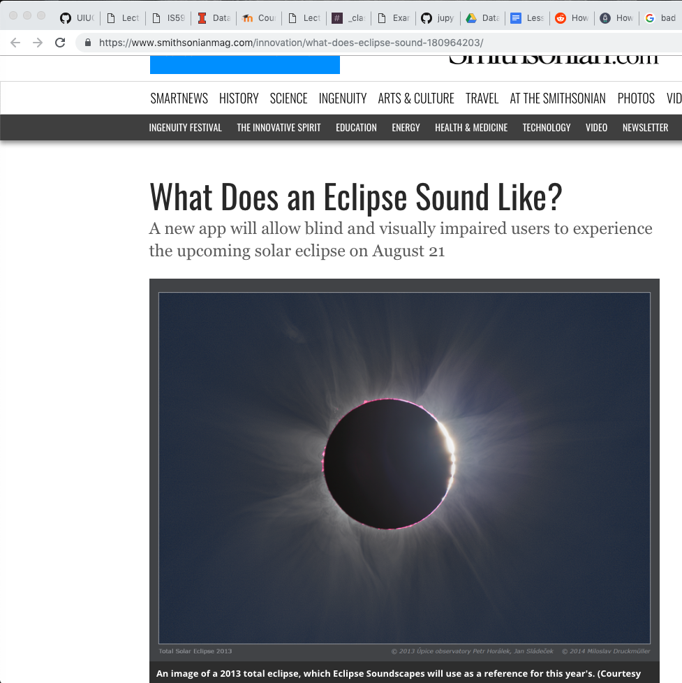
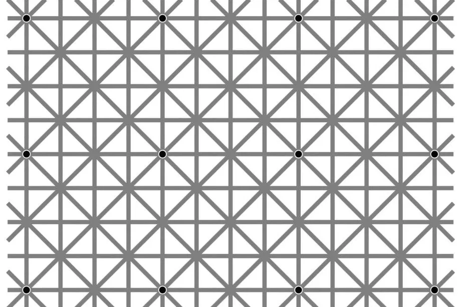
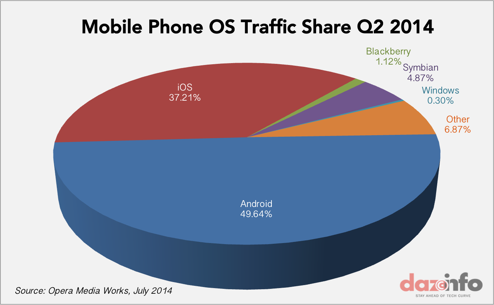

<!-- JPN: also check links to all external images -->

## Land Acknowledgment

Please see the Land Acknowledgment in the Syllabus.

[More information can be found on the Chancellor's
Website.](https://chancellor.illinois.edu/land_acknowledgement.html)

---

## COVID-19 Policies

Please see the statement about policies related to COVID-19 at the [top of the Syllabus](https://uiuc-ischool-dataviz.github.io/is445_oauoag_spring2023/syllabus.html).

---

## IS400 Colloquium

See for-credit [IS400 Colloquium](https://ischool.illinois.edu/degrees-programs/courses/is400) and your academic advisor for more info.

notes:
ok, onto more burocracy, but not Covid stuff for a change!

Just a heads up there is a colloqium if you want to learn more about folk's research

---

## Class Size Notes

74+ for this course!

**Strategies:**
 * a total of >10 hours of office hours (Prof+TA's) every week (we will be updating these hours shortly!)
 * utilize Slack for general question/answer (can be across sections!)
 * group options for several homeworks/final project

notes:
so, we have 74 students in this class, this is a large class!

we will go over some of these strategies in detail, but I wanted to give you an overview of somethings that we are doing to cover everybody AND some things you can do to help us and your fellow classmates out

the first thing is we have an extra >10 hours of help time outside of class to answer questions in the form of office hours (more details next slide) 

also, we will have a Slack channel (more on that in a moment) where you can get more quick responses from the instructional team if you post in the #general channel

finally, we have several assignments that can be turned in as a group to allow for collaboration between folks in the class, AND across class sections -- we'll talk about those assignments as we come to them

---

<!-- .slide: class="vertical_center" -->
## Basics

IN PERSON: 12:30-3:20PM Tuesdays

Jill P. Naiman - `jnaiman@illinois.edu`
 * Office Hours: Mon 3-4pm, Wed 12:45-1:45pm (online)
 
TA: Leon Hounnou - `hounnou2@illinois.edu`
 * Office Hours: Thurs, Fri 4-5pm (online)

TA: Guangchun Zheng - `gzheng6@illinois.edu`
 * Office Hours: Tuesdays 1:30-3:30pm (online)

TA: Xiujia Yang - `xiujiay2@illinois.edu `
 * Office Hours: TBD (online)

Course website: https://uiuc-ischool-dataviz.github.io/is445_oauoag_spring2023/

notes: 

Here are some of those hours of office hours for you.  We are still working on finalizing this and will add some more!

So you see that we have LOTS of office hours throughout the week -- this is with the idea that folks may be in and out of class as illness/etc happens (but hopefully doesn't!)

**TA's introduce themselves if they are on Zoom**

Again, we want to make sure there are lots of support for folks that have questions

Note that we have a shared canvas space across two sections (more on that in a moment) but seperate webpages where materials are

Now, the website!
**go through website!!**

---

## In summary: where things will be located:

 * Canvas: https://canvas.illinois.edu/courses/32263 - where the grades and assignments will be posted

 * Course webpage: https://uiuc-ischool-dataviz.github.io/is445_oauoag_spring2023/ - where lecture slides, notebooks, data & general course info will live.

 * Slack: https://is445-spring2023.slack.com/ - the best place to ask questions in the `#general` channel

---

## Questions:

* Who are you?
* What are we doing?
* How are we going to do it?

---

## Questions:

* Who are you?
* What are we doing?
* How are we going to do it?

---

### My background

<!---->

---

### My background

---

### My background

---

### My background

---

### My background
#### ytini.com

Naiman et al. 2017, Borkiewicz et al. 2018

---

### My background
#### ytini.com

Naiman et al. 2017, Borkiewicz et al. 2018

---

### My background
#### ytini.com

Naiman et al. 2017, Borkiewicz et al. 2018

---

### My background
#### ytini.com

Naiman et al. 2017, Borkiewicz et al. 2018

---

### My background
#### Scientific Digitization

Naiman et al. 2022, TPDL conference

notes:
also do some science digitization, i.e. trying to turn scans of old scientific figures back into data by having computers "read" objects and axis labels using image processing, optical character recognition and machine learning methods

---

## Timed activity! (~2 minutes)

On a piece of paper or in notes on your computer:

* What are the most memorable movies you saw over the last year?
* Do you prefer cats or dogs?
* How would you quantify your experience in visualization?
* How many hours do you spend online in classes each week?

notes:
We're going to use these pieces of data to explore how we might approach
visualization.  Each of these items is a different *type* of data --
qualitative, quantitative, elements drawn from sets, and sets of numerical
data.

Trying to visualize each one will give us a basic idea of how we might think
about these types of data, and how we approach visualizing them.

---

## In a breakout group

Visualize the results of your group's collective "data".

* What are the most memorable movies you saw over the last year?
* Do you prefer cats or dogs?
* How would you quantify your experience in visualization?
* How many hours do you spend online in classes each week?

Don't forget to say hi to eachother!

 * Jamboard 1 (Groups 1-10): https://jamboard.google.com/d/1JdXo144A0BIAb1wzeGU-5p_Sgfp5t3yCtu2hjRLSUnk/edit?usp=sharing
 * Jamboard 2 (Groups 11-20): https://jamboard.google.com/d/1nBi0qz9Dbk_qBJa5F8ClJzW0pB__2PriRWhYThs4UTs/edit?usp=sharing 

**There is a limit of 50 people per jamboard, so make sure you match your breakout group number.**

**You must be signed in with your @illinois.edu address.**

notes:

What was easy/hard about visualizing the various datasets?  How did you do it?

Feel free to do this on your own if you are more comfortable that way.

---

 
 
 

# Bureaucracy, continued

We have to do it!

---

## Getting Python Setup

**NOTE -** you might want to wait until break to do this.

 1. Download Anaconda!
 
[anaconda.com/download](anaconda.com/download)

 2. Install Week 1 libraries

see:
https://uiuc-ischool-dataviz.github.io/is445_oauoag_spring2023/week01/installation_instructions.html

---

## Syllabus

 * Week 1 (Today) - Introduction
 * Week 2 - Data Storage and Operations
 * Week 3 - Types of Viz and Choosing Colors
 * Week 4 - Beginning interactivity
 * Week 5 - Continuing interactivity with bqplot
 * Week 6 - More with dashboards & Map Viz (**possible flipped class**)
 * Week 7 - Maps, maps and more maps
 
notes:
This is a rough syllabus!  These are many of the topics we will cover, but
based on how the course proceeds and how folks respond, we may shorten or
lengthen different topics.

The organization here is designed to start out slow, dealing with how to
program python for visualization, understanding how data is laid out, which
operations we can apply to that data, and then moving on to representing data
in different ways.

We might start getting into javascript earlier, depending on how we are doing.

**be aware**: that we are trying out some "flipped" classes for this semester around the harder assignments so folks can get extra help -- this will happen around HW#6 and the final projects.  This just means that you are expected to watch the recording *before* the class and then come to the class with quesstions about the assignment

---

## Syllabus, cont

 * Week 8 - Starboard and Intro to Javascript
 * Week 9 - Spring break! No classes!
 * Week 10 - Viz Audience; More Starboard/Observable, Javascript & Vega-lite
 * Week 11 - Intro to Jekyll
 * Week 12 - More with Jekyll+Altair, Publishing Viz
 * Week 13 - A few more Jekyll+Altair+vega-lite things
 * Week 14 - More Jekyll+Altair+vega-lite things
 * Week 15 - Scientific Viz & AVL Guest lecture (**partially flipped class**)
 * Week 16 - Network Visualization & Word clouds (**probable flipped class**)

notes:
Toward the end of class we are going to have a slightly more free-form set of
discussion points.  Your final projects will be somewhat open-ended, requiring
more group work and collaboration than the preceding assignments.

Here the weeks get a little off between the in-person and online classes because of the election day holiday and this is also reflected in the Canvas page.  We'll be working on final project stuff then, so it shouldn't be an issue too much.

---

## Syllabus: In summary

 * Weeks 1-5: Basics of visualization (Python)
 * Weeks 6-10: Interactivity and Viz Types (Python and Javascript)
 * Weeks 11-16: Platforms and dimensionality (Python, Javascript, Web-dev methods)

notes:
basically, we'll start with the basics - I'm assuming you are coming in with Python experience

---

## Assumptions about Python experience

IS430 + a programming project

or 

IS205 + one more Python-based programming class

or

Equivalent informal Python background

notes:
so what do I mean by "python experience"?  Here are some rough guidelines for courses

Since there are no enforced pre-reqs, you can also get Python experience in industry as well

Basically, I'm expecting that you understand all the logical operations like if-then, for loops, are comfortable using external libraries, and reading/writing and manipulating data to some extent -- check out the prep notebooks for the level that is expected

I am also expecting that you have some experience not just doing python homeworks assigned in a class, but also doing a small project on your own where you had to practice some debugging, looking up answers on stackoverflow, etc

also be aware: as this is a graduate-level course, the homeworks will build on concepts we cover in class but may require extra out-of-class work on your behalf in cluding, but not limited to, coming to office hours and/or reaching out on slack

---

## Assumptions about Python experience

IS430 + a programming project

or 

IS205 + one more Python-based programming class

or

Equivalent informal Python background

Extra coding help: https://ischool.illinois.edu/student-life/academic-support-center (see Tutoring by Subject and Skill)

notes:
that being said, I have had students that were just starting off in their programming journeys be successful in this class, but just be aware its going to require extra time commitement

In addition to all of the hours of office hours, you should check out the academic support center, in particular the Tutoring by Subject and Skill where you can find Python tutors

---

## How much work in this class?

notes:
be aware that this was from a survey that generally happens ~1/2 way through the course, so later parts of the course might take more effort

some folks find the HW doesn't take that long, but others do say it takes longer -- I suspect this has to do with Python/programming background but since I didn't want identifying info in the survey I can't be certain

---

## Assumptions about your computer setup

New-ish computer

Have been keeping it updated to most recent-ish operating system

(If not, just let us know!)

notes:
I'm also making some assumptions about the computer you are going to be using for this class

1. I'm assuming it is a new-ish computer -- what does this mean?  This means purchased in the past few years, but there is a question on the intake survey with specifics
1. I'm also assuming you've been keeping your computer up to date with the most recent operating system available for your system.  How recent?  Again, this is not a hard and fast cut off I have in my mind, and the intake survey will have more detailed questions, but basically, if you haven't updated your OS in a year or more, you might run into issues in this class with several of the assignments

Now if you do have an older computer or haven't updated the OS in a while, please reach out to us ASAP!  This doesn't mean you can't take this class, but it does mean we might need to get you a loaner laptop or see about having IT update your OS for you.

---

# Class Mission

While you are already a _consumer_ of visualizations, your
perspective should change to that of a _producer_ of visualizations.
You should be comfortable reading AND writing imagery.

notes:
We will be discussing this as the semester goes on, but the principal outcome I
want you to take away from this class is understanding how to transform data
into its visual representation, and to take that understanding with you as you
observe visualizations presented to you.

By developing visualizations, you will grow to understand the choices that
influence those visualizations, and you will bring that with you while
consuming information visually.

---

# The Things I Want You To Take Away

 * You should know the basics of how to manipulate data -- aggregations,
   filterings, and other operations.
 * I want you to know _some_ of the packages that are out there to visualize
   data.  These will mostly be Python-based, with a couple in Javascript.
 * You won't learn how to use dashboarding software (e.g. Tableau) in detail. Instead, we
   will focus on the different operations that go into dashboarding software.
 * By the end of the course, you will have had the opportunity to look at and
   build visualizations in several different domains and understand how to
   interpret, critique and improve them.

notes:
This course *will* teach you some things about how to code, how to build
visualizations, but we're going to focus much more on learning about how to
construct visualizations and why we make the choices that we do.  If we choose
one way to present data, does that convey information more readily?  Or does it
get in the way of the underlying meaning?

---

## Overview - Themes and Goals

1. What are the components of an effective visualization of quantitative data?
1. What tools and ecosystems are available for visualizing data?
1. What systems can be put in place to generate visualizations rapidly and with high-fidelity representation?

---

## Structure of Class

 * Topic introduction and lecture (~60-90 minutes)
 * Hands-on, in class coding
 * Wrap-up

(Today will be a little lecture heavy)

**Some classes will be flipped!**

notes:
This structure will likely be deviated from during the course, but in general
we will start with lecture, take a break, then continue with collaborative or
hands-on exercises using group coding.

During the group coding, I might lead the class in some visualization in
Python, Javascript, or something else.  During this section, I expect that
students will *follow along* with what is going on -- typing in the specific
commands, and maybe even trying different things as we go.  It is not meant to
simply be a "performance" of coding, but instead an opportunity to learn.

YOU HAVE THE NOTES BEFORE CLASS.

final reminder -- some of the classes will be flipped!

---

## Grading

 * 50% Standard assignments in prose or code form (see syllabus for some details about "required" assignments)
 * 20% Weekly visualization reports
 * 30% Final project ([teaser trailer](https://jnaiman.github.io/online_cv_public/))

notes:
Your weekly assignments will take different forms.  The first assignment will
be mostly prose and hand-writing with some installations, but subsequent assignments will be
either notebook (coding) based or prose-based as well.

The final project will be described later in class, but will take the form of a
group project that touches on coding as well as visual design.

---

## Grading

 * 50% Standard assignments in prose or code form (see syllabus for some details about "required" assignments)
 * 20% Weekly visualization reports
 * 30% Final project ([teaser trailer](https://jnaiman.github.io/online_cv_public/))
 
**We will drop the lowest homework score, however there are some required assignments.**

notes:

part of the syllabus quiz will be checking out the HW policies in more detail -- we will drop the lowest HW score, however there 
are several assignments you must submit and get above a certain grade on to pass the class -- these are installation assignments 
and those that are considered "prepratory" for the final project

---

## Weekly Visualization Reports

Every week, you are to turn in a visualization you have found in the media
(newspapers, magazines, online journalism) and a brief summary of something you like/don't like,
think is interesting, etc.

_These are meant to be easy points:_ No more than 2-3 sentences are needed in your description.

---

## Assignments (not necessarily weekly)

 * Weekly-ish, assigned in class, collected following class
 * Prose assignments: deconstruction or analysis of a visualization or a dataset.
 * Coding assignments: Jupyter/JSMD/etc notebooks following step by step
   through collection and processing of data and the visualization of that
   data

---

## _Optional_ reading assignments

See the course syllabus: 

https://uiuc-ischool-dataviz.github.io/is445_oauoag_spring2023/syllabus.html

notes:
These are TOTally optional - more on that in a minute.

---

## Plagiarism

 * Plagiarism is about copying ideas.
 * Cite all code you utilize from elsewhere.
 
notes:
When programming, I expect that you will do things like search on the internet
to find help with a given problem.  This is fine.

But, you *must* cite where any code snippets came from.  And you *must* note if
you are working with other people in the group!

Using snippets of code is fine -- but you may not copy large-scale amounts of
code from other work (for example, other visualizations) and pass it off as
your own.  Always cite, and be reasonable in what you utilize.

---

## Plagiarism

 * Plagiarism is about copying ideas.
 * Cite all code you utilize from elsewhere.
 
TurnItIn is meant to help you with this process (for specific file types). 

notes:
turnitin is turned on for all assignments, but you can see your report right after you submit IF ITS THE RIGHT FILE TYPE

Depending on file type reports may/may not be supported (for example, its not supported for notebook files)

Click on "Submission Details" to see your report, but again, this will only work for specific kinds of files.

---

## Our software/languages

 * Python, with some Javascript along the way
 * [Jupyter](https://jupyter.org/) & Jupyter notebooks
 * The occasional usage of a shell such as bash
 * Git & [GitHub](https://github.com/) (toward end of class)
 * [Starboard](https://starboard.gg/) 
 * Markdown & [Jekyll](https://jekyllrb.com/)
 * Slack

notes:
You will be expected to write code in Python, and to learn the very basics of
Javascript.  Your projects may be turned in via git.  We will also utilize
Slack for class communication.

These tools represent many different ways to explore and visualize data.  We'll
use a mix of local installations & web-services.

---

## Viz Systems We Will Cover

In approximate order:

 * [matplotlib](https://matplotlib.org)
 * [bqplot](https://bqplot.readthedocs.io)
 * [vega-lite](https://vega.github.io/vega-lite)
 * [Altair](https://altair-viz.github.io/index.html)

There'll be a few more along the way.

notes:
This class is not meant to teach you a given tool, but instead a way of
thinking about using visualization tools.  These tools are chosen because of
what they represent, not because they are the only paths to success.

---

## Slack

We will be sharing a slack channel with the in-person class, so feel free to
converse with them as well!

 * Team channel at `https://is445-spring2023.slack.com`
   * `#general` : General announcements, place to ask questions
   * `#random` : see a cool viz you want to share?  This is the place!
   * `#introductions` : where you want to "say hi" for Homework #1

---

## Slack (cont)

 * Use the `@` sign appropriately: `@[person]`, `@here`, `@channel`
 * Web client, standalone client and mobile devices can access this team.
 * At the end of the semester, the team will be discontinued.
 * Please think carefully before direct messaging if you could ask in a public
   forum instead.
 * Conduct will be held to same standards as any educational venue.

notes:
Please use slack as much as you need!  You can use it to share items and
articles with the class, to collaborate, to discuss and ask questions and get
feedback.  However, please do behave in a professional fashion.

---

## Slack (cont)

 * Use the `@` sign appropriately: `@[person]`, `@here`, `@channel`
 * Web client, standalone client and mobile devices can access this team.
 * At the end of the semester, the team will be discontinued.
 * *Please think carefully before direct messaging if you could ask in a public
   forum instead.*
 * Conduct will be held to same standards as any educational venue.
 
Slack turn-around time ~24 business hours or less (general/section channel), email ~3 business days or less

Questions about grades should *always* be over email.

notes:
We aim for turn-around times for slack to be 24 hours or less when questions are posted to the general channel for others to see/comment on

personal questions (like about grades) should be over email

personal messages on slack will be treated as email and we'll get back to you within 3 days or less

---

## How do I access Slack?

 * Should have received instructions in welcome email
 * Send me an email with _your_ email

---

## Github

<!-- JPN: check all these links -->

 * Course repo is at [UIUC-iSchool-DataViz/is445_oauoag_spring2023/](https://github.com/UIUC-iSchool-DataViz/is445_oauoag_spring2023/) 
 * Automatically built to [uiuc-ischool-dataviz.github.io/is445_oauoag_spring2023/](https://uiuc-ischool-dataviz.github.io/is445_oauoag_spring2023/)  
 * Copy the notebooks to your directory before using them.

notes:
All the materials for this course will be stored in github, and are available
under a very permissive license.  It is largely written in markdown and
automatically compiled to web pages when changes are made.

You are invited to clone the repo, fork and submit changes (typos, etc!), and
to use any information in it in the future.

---

## Choose your own adventure

There are 3 pathways (that I can see in this course, could be more!)

 1. "I am here to get better at programming and play with viz platforms"
 1. "I am thinking about a career in data viz."
 1. "I don't know/I am new to programming and I want to focus on that."

---

## Choose your own adventure

There are 3 pathways (that I can see in this course, could be more!)

 1. "I am here to get better at programming and play with viz platforms"
    * Strategy:
       * look at the code and the extended examples
       * do the Javascript/Jekyll parts

---

## Choose your own adventure

There are 3 pathways (that I can see in this course, could be more!)

 2. "I am thinking about a career in data viz."
    * Strategy: 
       * look at the code
       * do the Javascript/Jekyll parts
       * read the optional texts/docs 

---

## Choose your own adventure

There are 3 pathways (that I can see in this course, could be more!)

 3. "I don't know/I am new to programming and I want to focus on that."
    * Strategy: 
       * look at the code, focus heavily on Python
       * read the prep notebooks before class!
	   * look into some extra Python tutoring with the Academic Support Office
       * do the Javascript/Jekyll parts, think about joining a group for the final project
       * if you're new to programming, do Javascript/Jekyll parts in class, and build on them for any assignments
       * come back to the optional texts/docs after the course is over

---

## Other strategies for success

 1. Some assignments are assigned over 2 weeks - use full 2 weeks!
 1. There are extra credit opportunities, the max HW score is 50% (it might look like >50% because of how Canvas grades, but we will modify it for final grades)

---

## Other strategies for success

 1. Some assignments are assigned over 2 weeks - use full 2 weeks!
 1. There are extra credit opportunities, the max HW score is 50% (it might look like >50% because of how Canvas grades, but we will modify it for final grades)
 1. Start assignments early!  This will give you an opportunity to ask questions and debug before the due date
 1. Access the course materials in the best way possible for you (but be sure this is actually the best way)
 
notes:
a few other suggestions about how to do well in this course
1. start the assignments early! we list in our syllabus the approximate turn-around times expected for questions and thsi can be 24 business hours.  We will try to be quicker about it, but it will not always be possible to answer questions at the last minute before the assignment is due. This can be an issue because, as with all coding assignments, you can expect to do some significant debugging
1. there are multiple ways to access the course material - including in class, through recordings, and in the prep materials/notebooks.  It will be tempting to just tell yourself that you'll watch the recordings later and not have to go to class.  Some things to keep in mind about that strategy:
  * the iSchool has a policy of sychronous classes, i.e. we expect you to be here (even if I'm not taking attendance)
  * you have to be honest with yourself if this going to be the best strategy for you -- if you are newer to programming or are still figuring out how you work best on technical assignments, it will be very very easy to fall behind.  Also, we will expect that you are familiar with the material when questions do come up on assignments, so a lot of your time will be wasted if our best answer for you is "look at what we did in class"

---

 
 
 

# We are done with bureaucracy!

---

 
 
 

# On to Viz topics!

---

### Why any data viz course will feel a little weird

notes:
there is a *huge* overlay of topics that cover data viz - from the neurology of how your prefrontal cortex process information, to how humans process storytelling, to data analytics, and color theory and the list goes on!

---

### Why any data viz course will feel a little weird

notes:
this is another way of looking at this.

here is the overall diagram of the things we'll cover in this class -- you can see there are a lot of topics from different areas and they are all interconnected.

---

## This week

 * What is a visualization?
 * Why do we visualize?
 * What types of data do we visualize?
 * How do we visualize?

notes:
We're going to start out at a very high-level, discussing why we choose to
visualize versus other types of representation, what types of data, and how we
might do it.

---

## What is a visualization anyway?

"Computer-based *visualization* systems provide visual representations of datasets designed to help people carry out tasks more effectively."

   * Visualization Analysis & Design, Tamara Munzner

notes:
I really like this definition because it gives us a sense of purpose - i.e. that our visualization must help a human with a task that has to do with data.

---

## What is a visualization anyway?

"Computer-based *visualization* systems provide visual representations of datasets designed to help people carry out tasks more effectively."

   * Visualization Analysis & Design, Tamara Munzner

Data Viz is task oriented:

notes:
here for example, we might want to know the labels of bones or how they fit together

---

## What is a visualization anyway?

"Computer-based *visualization* systems provide visual representations of datasets designed to help people carry out tasks more effectively."

   * Visualization Analysis & Design, Tamara Munzner

... versus artistic representations used to convey emotions:

---

## What is a visualization anyway?

"Computer-based *visualization* systems provide visual representations of datasets designed to help people carry out tasks more effectively."

   * Visualization Analysis & Design, Tamara Munzner

... versus movies, comics, or other cinematic representations used to tell stories:

notes:
we will be using artistic concepts and elements of storytelling, BUT that is not our focus -- here we are TASK oriented.

---

# Why?

(Or rather, why _wouldn't_ we visualize?)

notes:
Not everything suits itself to visualization -- and part of the reason for that
is the necessary reductionism that visualization can require.

---

# We can't visualize everything

Peg + Cat:
https://www.youtube.com/embed/In72QAQJ1tY?rel=0

notes:
"There are lots of thing you can compare on a graph / Like who is the shortest
or the tallest giraffe / You can chart how much you walk / How much that you
laugh / There are lots of things you can compare on a graph"

"But the one thing you can't chart / Is how you feel in your heart"

---

# We can't visualize everything

Peg + Cat:
https://www.youtube.com/embed/In72QAQJ1tY?rel=0

"There are lots of thing you can compare on a graph / Like who is the shortest
or the tallest giraffe..."

notes:
"There are lots of thing you can compare on a graph / Like who is the shortest
or the tallest giraffe / You can chart how much you walk / How much that you
laugh / There are lots of things you can compare on a graph"

"But the one thing you can't chart / Is how you feel in your heart"

---

# We can't visualize everything

Peg + Cat:
https://www.youtube.com/embed/In72QAQJ1tY?rel=0

"But the one thing you can't chart / Is how you feel in your heart"

notes:
"There are lots of thing you can compare on a graph / Like who is the shortest
or the tallest giraffe / You can chart how much you walk / How much that you
laugh / There are lots of things you can compare on a graph"

"But the one thing you can't chart / Is how you feel in your heart"

---

# We can't visualize everything

notes:
for example, here is a haptic, or touch based "visualization" for the blind & visually impaired

---

# We can't visualize everything

notes:
you should check it out, because its a thing we are also not going to cover!

---

<!-- .slide: data-background-image="images/fov.svg" data-background-size="contain" -->

notes:
Visual information is communicated through our eyes, where it is processed.  At
the most basic level, we can see a range of about 210 degrees horizontally with
one or both eyes.  The region that is covered by both ("binocular") is about
114 degrees in extent.

You can only cram so much information into the human eye.

---

By Vanessa Ezekowitz [CC BY-SA 3.0](https://creativecommons.org/licenses/by-sa/3.0), via Wikimedia Commons

notes:
When we think about visual communication of information, we *must* think about
how human physiology interacts with that communication.

Also, fair warning: I'm not a medical doctor.

This diagram shows the visual acuity of a "standard" human eye, as a function
of angular distance from the fovea.  We have to think about this in
*conjunction* with our field of view.

---

# Your brain does interpolation

There are 12 dots, can you count them all at the same time?

(You should bring up the slides yourself to see these optical illusions)

---

# Your brain does interpolation

Step 1: Look at the cross

Step 2: Close left eye, keep looking at the cross

Step 3: Slowly move your head toward & away from screen until dot disappears

(You should bring up the slides yourself to see these optical illusions)

---

# Your brain does interpolation

Step 1: Look at the cross

Step 2: Close left eye, keep looking at the cross

Step 3: Slowly move your head toward & away from screen until dot disappears

# ... and sometimes it gets it wrong!

---

# Even so, the visual cortex is great for information transfer

Your visual cortex is processing information from different parts of this page AT THE SAME TIME which means it can do impressive things very quickly.

---

Can you spot the differences?

notes:
compare this to how long it would take to spot differences in 2 songs - you'd have to listen to both songs (probably more than once) and compare after!  This would be sequential rather than parallel data transfer!

---

# Try it with sound

* [Moonlight Sonota, 1](https://soundcloud.com/redreapergrell/beethoven-moonlight-sonata)
* [Moonlight Sonota, 2](https://soundcloud.com/user-37232775/sets/beethoven-moonlight-sonata)

Try doing the same thing with these on your own!

notes:
time this activity, give them 1.5 minutes

ask: how long did this take you?  How many differences were there?
I spotted tempo as one (but you can cheat by looking at the timer on the bottom!)

Also, you can look at how different each of the sound-bars are on each link and see how different the music looks visually!

---

# Visualization augments human data analysis capabilities

 * enhances our ability to pattern find
 * allows us to summarize data quickly
 * allows us to search our data quickly

---

## An example: Read this next table to yourself!

notes:
(This part is a bit of a stunt.  Sorry.)

---

*Read these numbers:*

| | |
|:-|-:|
| 2007-01-01 | 14233.2 |
| 2007-04-01 | 14422.3 |
| 2007-07-01 | 14569.7 |
| 2007-10-01 | 14685.3 |
| 2008-01-01 | 14668.4 |
| 2008-04-01 | 14813.0 |
| 2008-07-01 | 14843.0 |
| 2008-10-01 | 14549.9 |
| 2009-01-01 | 14383.9 |

notes:
See what I mean?  It's a stunt.  You're supposed to hear these, or look at the
numbers, and not have as clear an impression.  It also takes a lot longer.

Can you read the trends here at all?

---

notes:
You might immediately notice a few things about this image, but one item that
we will talk about as class goes on is that often visualizations can have a
consistent style.  FRED in particular has a "branding" that is quite obvious,
even without the logo.

Also, the data we read was in the last sort of gray area of this graph.

---

## Anscombe's Quartet

This famous example show's 4 datasets with the exact same mean, varience and correlation coefficient.

Statistics can be useful, but visualization generated context!

---

## Same thing but with a dinosaur

Statistics can be useful, but visualization generated context!

---

 
 
 

# A few final considerations.

---

# Who are you visualizing for?

* For yourself?
* For a peer?
* For someone else?

notes:
*Whenever* you build a visualization you need to think about the context that
you can assume on the part of your viewer.

We will talk about how your viz changes with audience in this course.

---

# Tenet 1:

"Visualizing data" is not a strict subset of "making an image."

 * Collection of the data
 * Organization of that data
 * Representation of that data

notes:
We will approach visualization as encompassing several different stages in the
collection, organization and representation of data.

---

# Tenet 2:

We tell lies to visualize, but we _must_ be honest. (Stuart Levy, AVL)

 * No representation is going to convey the entire complexity of a dataset.
 * Some representations are better than others.

---

### "The Principle of Proportional Ink" - callingbullshit.org

notes:
So let's first talk about how misleading visualizations can be. This 3D pie chart violates the "principle of proportional ink" which states that the number of pixels that represent a value should be proportional to the value. With the raised edge on the pie chart, the blue wedge gets way more ink than it deserves and you get a disproportionate sense of value.

---

### "Spurious Correlations" - tylervigen.com

notes:
you can have a lot of absurd fun with data - but when data is presented in a visualization, people often believe the authority of it even if it's outlandish. 

This guy has some good ideas of where to find sample datasets for upcoming homework assignments too!

---

<!-- .slide: data-background-image="images/barCharts.png" data-background-size="contain" -->

notes:
Each of these bar chart examples are meant to show the same data. But you can see how they're a bit problematic.

---

<!-- .slide: data-background-image="images/gunDeaths.jpg" data-background-size="contain" -->

notes:
Now here's an example that's more brazen. I'll give you a minute to analyze this and tell me what's wrong with this graph.

Some people will claim the Y-axis should always start from the bottom - at zero - to avoid confusion.

---

<!-- .slide: data-background-image="images/keelingCurve.svg" data-background-size="contain" -->

notes:
however, the Keeling Curve is an interesting counter-argument. This is the famous graph that was the original evidence for global warming, showing the rate at which atmospheric carbon dioxide was growing. 

Does anyone know why it's generally accepted to show the y-axis like this, without it starting at the zero axis?

---

<!-- .slide: data-background-image="images/hearts_battery.svg" data-background-size="contain" -->

notes:
here are a few more representations of data that you've probably run into!

---

<!-- .slide: data-background-image="images/battery.svg" data-background-size="contain" -->

 1. Sensors read the current "fill" of the battery
    * Analog / digital conversion
    * Normalized with respect to expected "full"
 1. This is then scaled to a percentage
 1. The battery image is filled from left to right
 1. The image is then rasterized and displayed

notes: what goes into this representation

---

<!-- .slide: data-background-image="images/hearts_bw.svg" data-background-size="contain" -->

 * Some fixed maximum amount of damage
 * Each time damage is taken, decrement
 * Each time damage is reversed, increment
 * Display number of hearts as appropriate

---

2 out of 3 "points"

<!-- .slide: data-background-image="images/hearts_color.svg" data-background-size="contain" -->

---

<!-- .slide: data-background-image="images/hearts_color.svg" data-background-size="contain" -->

---

<!-- .slide: data-background-image="images/stitch_bg.png" data-background-size="contain"-->

notes:
This is a screenshot from the movie "Lilo and Stitch" where the little girl Lilo is graphing how much evil is in the alien Stitch. It borrows from a familiar visual - the thermometer. But how could this visualization be misinterpreted? How is it different from a thermometer?

---

<!-- .slide: data-background-image="images/stitch_nobg.png" data-background-size="contain"-->

notes:
The angle can be misleading. So can the relative width of the head vs the feet. The surface area is not consistent from top to bottom. Also there are empty areas in the mouth and eyes!

---

<!-- .slide: data-background-image="images/stitch_nobg_tilted.png" data-background-size="contain"-->

notes:
If we rotate the image so that the red liquid is level, do we get a different impression for how much bad is in Stitch?

---

## Honesty

Our choices must be:

 * Deliberate
 * Informed
 * Motivated
 * Justifiable

---

## Election Maps

Mark Newman of the University of Michigan has created visualizations of the
election maps from several of the most recent elections.  For more information
and context, see his page http://www-personal.umich.edu/~mejn/election/2008/ .

 * [Map 1](http://www-personal.umich.edu/~mejn/election/2008/statemapredbluer1024.png)
 * [Map 2](http://www-personal.umich.edu/~mejn/election/2008/statepopredblue1024.png)
 * [Map 3](http://www-personal.umich.edu/~mejn/election/2008/countymapredbluer1024.png)
 * [Map 4](http://www-personal.umich.edu/~mejn/election/2008/countymappurpler1024.png)
 * [Map 5](http://www-personal.umich.edu/~mejn/election/2008/countycartpurple1024.png)

notes:
These are great, but some criticisms might be that the color red is more apparent to the human eye than the color blue. And in the population-to-area adjusted maps, it's difficult to read for people used to geographic accuracy.

Map1 - this is just a geographical map of red and blue

Map2 - cartogram weighted by population (note, NOT by electoral college population)

Map3 - election results by county

Map4 - percentage of votes by county

Map5 - percentage of votes by county, weighted by population

---

## Getting started in Python

*Open up Python & get started coding!*

---

## This week: Wrap-up

 1. We visualize to change how we understand things.
 1. We visualize data for ourselves, for our peers, and for others.
 1. Visualization is a series of steps that we take to produce a different
    representation of data.

---

## Assignment 1

 *Go to Canvas to discuss!*

---
