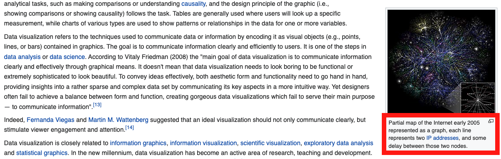

<!-- .slide: data-background-image="turnitin/slide10.png" data-background-size="auto 100%" data-background-position="right 50% bottom 50%" -->

notes:

so, lets say I want to turn in a weekly viz and I google for data viz and find this great example on wikipedia

---

<!-- .slide: data-background-image="turnitin/slide2.png" data-background-size="auto 100%" data-background-position="right 50% bottom 50%" -->

notes:
and I find some phrases I really like and want to include in my assignment

---

<!-- .slide: data-background-image="turnitin/slide9.png" data-background-size="auto 100%" data-background-position="right 50% bottom 50%" -->

notes:
so I just include those phrases just as is in my weekly writup

---

<!-- .slide: data-background-image="turnitin/slide3.png" data-background-size="auto 100%" data-background-position="right 50% bottom 50%" -->

notes:
ok, so I save this as a docx file and submit this on my homework page

---

<!-- .slide: data-background-image="turnitin/slide4.png" data-background-size="auto 100%" data-background-position="right 50% bottom 50%" -->

notes:
now I see this page and some confettii which is great

but I don't know if this is a problimatic submission, how do I check? ...

---

<!-- .slide: data-background-image="turnitin/slide4.5.png" data-background-size="auto 100%" data-background-position="right 50% bottom 50%" -->

notes:
what I can do is click on "submission details" in the upper left corner

---

<!-- .slide: data-background-image="turnitin/slide7.png" data-background-size="auto 100%" data-background-position="right 50% bottom 50%" -->

notes:
you'll then have to agree to the terms of service

---

<!-- .slide: data-background-image="turnitin/slide5.png" data-background-size="auto 100%" data-background-position="right 50% bottom 50%" -->

notes:
you'll then see this screen...

---

<!-- .slide: data-background-image="turnitin/slide5.5.png" data-background-size="auto 100%" data-background-position="right 50% bottom 50%" -->

notes:
this icon means that your similarity report is being generated

---

<!-- .slide: data-background-image="turnitin/slide6.png" data-background-size="auto 100%" data-background-position="right 50% bottom 50%" -->

notes:
then I see that I've got an 80% similarty which is even highlighted as bad because its red (we'll talk about colormaps more next week!)

what are some of the issues?

---

<!-- .slide: data-background-image="turnitin/slide6.5.png" data-background-size="auto 100%" data-background-position="right 50% bottom 50%" -->

notes:
if I click on this little tag, it will take me to my similarit report

---

<!-- .slide: data-background-image="turnitin/slide8.png" data-background-size="auto 100%" data-background-position="right 50% bottom 50%" -->

notes:
so here we can see its indeed the phrases I copied -- no big surprize here!  So, how can I fix this?

---

<!-- .slide: data-background-image="turnitin/slide8.5.png" data-background-size="auto 100%" data-background-position="right 50% bottom 50%" -->

notes:
One tempting solution is just to put quotes around all direct quotes but then leave as is like

I've even included citations and everything!  Let's try again...

---

<!-- .slide: data-background-image="turnitin/slide6.png" data-background-size="auto 100%" data-background-position="right 50% bottom 50%" -->

notes:
so now I'll go back to the main view...

---

<!-- .slide: data-background-image="turnitin/slide6.75.png" data-background-size="auto 100%" data-background-position="right 50% bottom 50%" -->

notes:
and click on "re-submit assignment" to try again

and do all the steps to re-generate and check my report

---

<!-- .slide: data-background-image="turnitin/slide15.png" data-background-size="auto 100%" data-background-position="right 50% bottom 50%" -->

notes:
and I'll do all of that and see that its still pretty high -- 78%

---

<!-- .slide: data-background-image="turnitin/slide14.png" data-background-size="auto 100%" data-background-position="right 50% bottom 50%" -->

notes:
if I click in, I'll still see the same areas highlighted -- why? well even though I cited my sources, the majorty of my submission is actually other people's words, which isn't what we are going for (more on the motivation on that in a minute)

---

<!-- .slide: data-background-image="turnitin/slide14.5.png" data-background-size="auto 100%" data-background-position="right 50% bottom 50%" -->

notes:
Let's try again.  So, how I re-explain in my own words what this diagram is and how it was made.  I still use the quote from wikipedia, but I also have an extra sentence describing how that quote relates to *my interpretation* of the figure.

Notice -- the grammar isn't as nice, and the language is much less formal.  This is totally fine!

Let's try resubmitting now.

---

<!-- .slide: data-background-image="turnitin/slide16.png" data-background-size="auto 100%" data-background-position="right 50% bottom 50%" -->

notes:
hey look at that!  its much better!

---

<!-- .slide: data-background-image="turnitin/slide17.png" data-background-size="auto 100%" data-background-position="right 50% bottom 50%" -->

notes:
now if I click on the similarity score again and see my report we can see that the quotes are still highlighted, but this is fine because the majority of the text is mine

---

## Other ways TurnItIn can "ding" you

1. Other students' submissions in the class
  * You will *both* be flagged.

notes:
what are some other ways turnitin might ding you? 

well let's say you're trying to help a friend out because they are super busy -- one thing you might want to do is let them look over *your* submission.  If they copy large chunks of words from your submission, you will both get flagged.  Be aware: this means, potentially *both* of you will have to deal with a FAIR violation as it doesn't really matter who shared and who copied -- they are both participation in plagurism

---

## Other ways TurnItIn can "ding" you

1. Other students' submissions in the class
  * You will *both* be flagged.
  * This won't show up until you *both* have turned in the assignment
  
notes:

a tricky thing about this is that if you turn your assignment in before your friend, you may have a "green" turn it in score, however it will turn red as soon as your friend turns in the assignment and if you don't check it then, you will miss the fact that you have been dinged for plagurism 

---

## Other ways TurnItIn can "ding" you

1. Other students' submissions in the class
  * You will *both* be flagged.
  * This won't show up until you *both* have turned in the assignment
1. Submissions from other classes/schools
  
notes:
you can also get dinged for submissions that overlap with submissions in other courses

this *also* can happen across other campuses that use Canvas (i.e. not just UIC but also like Texas A&M)

---

## Other ways TurnItIn can "ding" you

1. Other students' submissions in the class
  * You will *both* be flagged.
  * This won't show up until you *both* have turned in the assignment
1. Submissions from other classes/schools
1. The TurnItIn score alone may *NOT* be able to tell you if it is plagiarism.
  
notes:
another issue is that the score ALONE is not enough to tell you if you are "safe" -- you really need to pay attention to 
how you are including any words/citations

---

## TurnItIn -- Score is not enough!

notes:
so just a reminder that TurnItIn is turned on for the extra credit assignment and there a few things you should be aware of!

---

## TurnItIn -- Score is not enough!

notes:

so for example, let's say I like this phrase right here the I found online how would include this in any write-up?

---

## TurnItIn -- Score is not enough!

... one really interesting visualization is a partial map of the Internet early 2005 represented as a graph, each line represents two IP addresses, and some delay between those two nodes, this is an excellent example of...

notes:
so we know that we don't want to just copy this without a reference into our assignment...

---

## TurnItIn -- Score is not enough!

... one really interesting visualization is a <mark>partial map of the Internet early 2005 represented as a graph, each line represents two IP addresses, and some delay between those two nodes</mark>, this is an excellent example of...

notes:

... this will then be flagged by TurnItIn

---

## TurnItIn -- Score is not enough!

... one really interesting visualization is a <mark>partial map of the Internet early 2005 represented as a graph, each line represents two IP addresses, and some delay between those two nodes</mark>, this is an excellent example of...

 **Issue:** This makes it sound like this sentence is one you wrote on your own.

notes:

... this will then be flagged by TurnItIn

---

## TurnItIn -- Score is not enough!

... one really interesting visualization is a <mark>partial map of the Internet early 2005 represented as a graph, each line represents two IP addresses, and some delay between those two nodes</mark>, this is an excellent example of...

...
[3] https://en.wikipedia.org/wiki/Data_and_information_visualization
...

notes:

so one thing we might want to do is add in a reference somewhere at the bottom of our write up...

---

## TurnItIn -- Score is not enough!

... one really interesting visualization is a <mark>partial map of the Internet early 2005 represented as a graph, each line represents two IP addresses, and some delay between those two nodes</mark>, this is an excellent example of...

...
[3] https://en.wikipedia.org/wiki/Data_and_information_visualization
...

**Issue:** No way to tell what *part* of your write-up is coming from reference [3]

notes:

unfortunately, this is still plagurism.  Why? Because there is no way to tell where this specific sentence comes from -- even though there is a reference at the bottom, it could be the whole write-up as far as we know!

---

## TurnItIn -- Score is not enough!

... one really interesting visualization is a "<mark>partial map of the Internet early 2005 represented as a graph, each line represents two IP addresses, and some delay between those two nodes</mark>", this is an excellent example of...

...
[3] https://en.wikipedia.org/wiki/Data_and_information_visualization
...

**Issue:** Still don't know which reference this sentence comes from.

notes:

Similar with this -- here we have quotes around the exact sentence BUT we still don't know WHICH reference this sentence comes from

---

## TurnItIn -- Score is not enough!

... one really interesting visualization is a "<mark>partial map of the Internet early 2005 represented as a graph, each line represents two IP addresses, and some delay between those two nodes</mark>" [3], this is an excellent example of...

...
[3] https://en.wikipedia.org/wiki/Data_and_information_visualization
...

**Issue:** None!  Outstanding!

notes:

The final piece we are missing is the reference number at the end so this shows us WHAT you are quoting AND where that exact quotation comes from.

---

## TurnItIn -- Score is not enough!

## BOTH OF THESE WILL HAVE THE SAME TurnItIn SCORE

### Wrong
... one really interesting visualization is a <mark>partial map of the Internet early 2005 represented as a graph, each line represents two IP addresses, and some delay between those two nodes</mark>, this is an excellent example of...

### Correct
... one really interesting visualization is a "<mark>partial map of the Internet early 2005 represented as a graph, each line represents two IP addresses, and some delay between those two nodes</mark>" [3], this is an excellent example of...

...
[3] https://en.wikipedia.org/wiki/Data_and_information_visualization
...

notes:

one thing to be super aware of is that the TurnItIn scores for these will be the same! so you really need to check the reports -- there is no "safe" score

---

## TurnItIn -- Score is not enough!

"<mark>To communicate information clearly and efficiently, data visualization uses statistical graphics, plots, information graphics and other tools. Numerical data may be encoded using dots, lines, or bars, to visually communicate a quantitative message.[10] Effective visualization helps users analyze and reason about data and evidence.[11] It makes complex data more accessible, understandable, and usable, but can also be reductive.[12] Users may have particular analytical tasks, such as making comparisons or understanding causality, and the design principle of the graphic (i.e., showing comparisons or showing causality) follows the task. Tables are generally used where users will look up a specific measurement, while charts of various types are used to show patterns or relationships in the data for one or more variables.</mark>" [3]

...
[3] https://en.wikipedia.org/wiki/Data_and_information_visualization
...

**Issue:** Not technically plagiarism, but also not *your* submission!

"Rule of thumb" is $\le$ 10\% should be quotes.

notes:
so if you copy large swaths of pages and turn it in, even with quotes, this won't get you a good grade -- this isn't plagurism, but it's also NOT an assignment of your work!

in this case, you'd get a 0% since this isn't a submission of your work

---

## Motivation

notes:
so, why are we going through this whole process?

---

## Motivation

https://provost.illinois.edu/policies/policies/academic-integrity/students-quick-reference-guide-to-academic-integrity/

notes:
one motivation is the fact that we sort of have to -- its part of university policy

We are going through this whole FAIR process to avoid having to go through the FAIR violation process

if you do get a FAIR violation I want to highlight the page **go to website** where it says DO NOT PANIC -- please hed this advice!

---

## Motivation

https://provost.illinois.edu/policies/policies/academic-integrity/students-quick-reference-guide-to-academic-integrity/

Educational benefits:
 * practice writing skills
 * paraphrasing helps us [cement understanding](https://www.ascd.org/books/summarization-in-any-subject-60-innovative-tech-infused-strategies-for-deeper-student-learning-2nd-edition?chapter=summarizing-savvy) 

notes:
more important to that is the educational benefits

 * writing is hard, technical writing is harder -- this is an opportunity to practice!
 * paraphrasing, summarizing, and things like this actually helps us understand subjects better -- another opportunity to practice this!

Also see: https://www.amazon.com/Summarization-Any-Subject-Innovative-Tech-Infused/dp/1416626778
