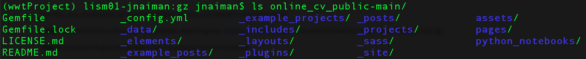
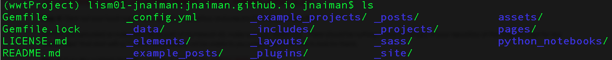
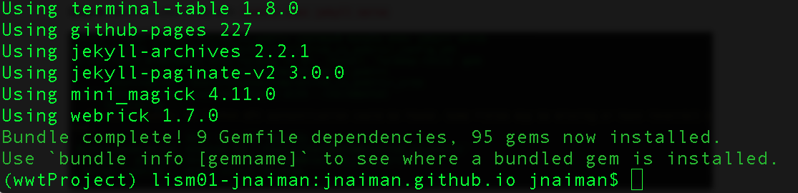
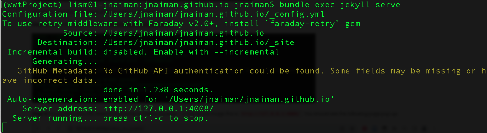
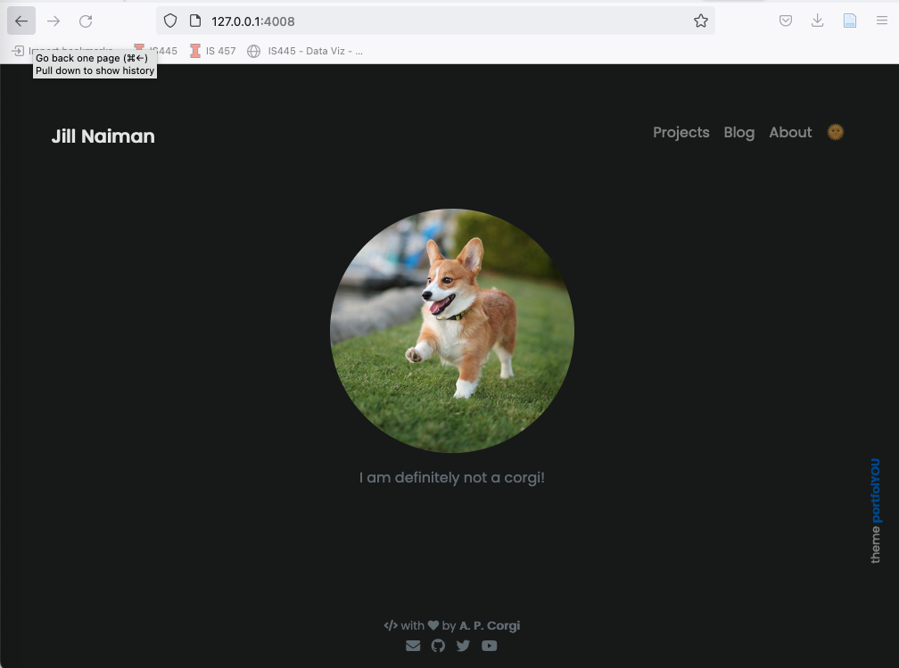
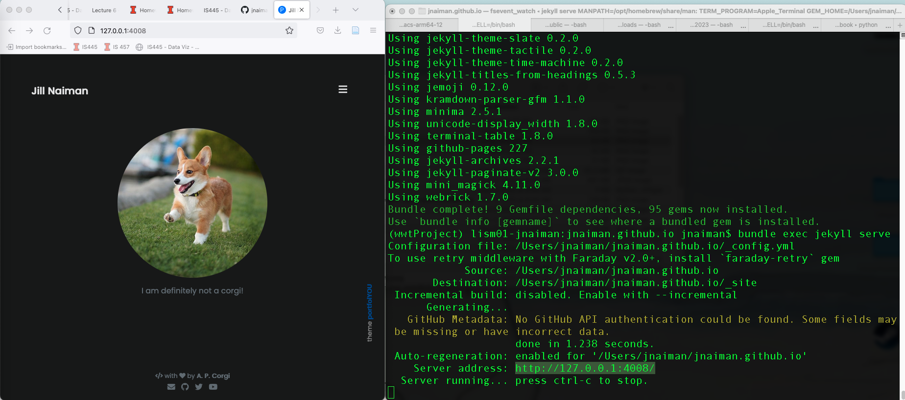

 
# Installation instructions: Ruby, Ruby Gems, Jekyll & Our Online Resume Template

## 1. Install Jekyll, Ruby & bundler

Follow the links for your system below.  **NOTE:** You will likely want to do this *outside* of your DataViz conda environment.

### General notes

If you already have Ruby installed (i.e. the "system" Ruby) -- *make sure you check the installation instructions for your relevant system anyway* -- it's possible you will want to install a non-system Ruby version.

If you already have Jekyll installed -- make sure it's the most recent version.

Pay attention if there are "next steps" listed after any of the commands, and make sure you do them.  

#### For example, **on a Mac** after brew installs you'll see:

```
==> Next steps:
- Run these two commands in your terminal to add Homebrew to your PATH:
    echo 'eval "$(/opt/homebrew/bin/brew shellenv)"' >> /Users/jnaiman/.bash_profile
    eval "$(/opt/homebrew/bin/brew shellenv)"
```

You need to run these two lines (echo and eval lines) in order to have the "brew" command in your path.

And after the Mac installation you'll see the instructions (for the .zshrc shell its a little different):

```
echo "source $(brew --prefix)/opt/chruby/share/chruby/chruby.sh" >> ~/.bash_profile
echo "source $(brew --prefix)/opt/chruby/share/chruby/auto.sh" >> ~/.bash_profile
echo "chruby ruby-3.1.2" >> ~/.bash_profile # run 'chruby' to see actual version
```

Make sure you run these as well and re-open a Terminal window so that the relevant packages will be in your path *or* you can do `source ~/.bash_profile` (bash)/`source ~/.zshrc`(zsh).


### [Instructions for Macs](https://jekyllrb.com/docs/installation/macos/)

For Macs you may have to also install bundler: `gem install jekyll bundler` instead of just Jeykll (`gem install jekyll`), but first try to run the test webpage without this extra install and see if you get any errors.

See above notes about making sure to run a few things in your Terminal window after your install.

#### Tips & Tricks for Macs

1. If you see `ld: symbol(s) not found for architecture arm64` or something similar.
 * Try installing ruby with `ruby-install ruby -- --enable-shared`

### [Instructions for Windows](https://jekyllrb.com/docs/installation/windows/)


#### Tips & Tricks for Windows
 1. Make sure you follow *all* the steps, all the way until the end of the page -- you also have to do things like install bundler.


### [Instructions for Ubuntu Linux](https://jekyllrb.com/docs/installation/ubuntu/)

### [Instructions for Non-Ubuntu Linux](https://jekyllrb.com/docs/installation/other-linux/)


## 2. Get Online Resume Template

**Notes for Windows install:**
 * You need to have git installed - <a href="https://git-scm.com/">download link here</a>.  You will have to restart your computer.
 
For Mac, you should have git already installed (but you can install it [here](https://git-scm.com/download/mac) just in case).

**Step 1:** Download the online-resume template Jekyll page by [clicking on this link here](https://github.com/jnaiman/online_cv_public/archive/master.tar.gz).  This should download a file called `online_cv_public-main.tar.gz`.

**Step 2:** Unpack this gzip-ed tar ball in the "usual way" for your machine.  

For example, on a Mac, if you are in the command line you could run `tar -xvf online_cv_public-main.tar.gz` 

You should now see a directory called `online_cv_public-main` which contains the following files:



## 3. Ready your github.io page for modifications

**Step 1:** If you have not downloaded (i.e. "cloned") this repository to your local machine, now is the time to do this.  The command you will use is:

`git clone https://github.com/<GITHUB_USERNAME>/<GITHUB_USERNAME>.github.io.git`

**Step 2:** Clear out your local copy of your github.io repository and prepare it to transfer these files.  

*NOTE:* if you uploaded an index.html file as part of Homework #5, make sure you delete this -- *there should be nothing in your local copy of your repository at this stage* (except for any "hidden files" that start with a ".", which will probably not be visible to you unless you know how to look for them).

**Step 3:** Copy the contents from the unpacked `online_cv_public-main` directory to your cloned github.io repository.

Your github.io directory should now look like:



## 4. Host your webpage locally

**Step 1:** change to your github.io directory with `cd <PATH_TO_LOCAL_REPO>/<GITHUB_USERNAME>.github.io.git` in the Terminal/Anaconda Prompt

**Step 2:** In this directory, build the Jekyll page with `bundle install` in the Terminal/Anaconda Prompt



You should see this at the end of the bundle command.

**Step 3:** Serve the site locally with `bundle exec jekyll serve`



**Step 4:** Navigate to the URL listed in a Chrome or Firefox browser -- in the above image this is `http://127.0.0.1:4008/`.  You should see the following page pop up:




**Step 5 -- First part of submission:** Take a screenshot of a side-by-side of your running Terminal/Anaconda Prompt and the served webpage like so:



This screenshot serves as your submission for this portion of the homework assignment.

## 5. Host your webpage remotely

**Step 1:** Push your local changes to your remote hosting page with git commands:

`git status` (check the additions to be made)

`git add -A` (add all changes)

`git commit -m "upload template"` (commit the changes)

`git push` (push all changes from local to remote site)

**Step 2 -- Second part of submission:** Wait for your site to build (you can check the Environments tab or just keep refreshing your <GITHUB_USERNAME>.github.io webpage).  Once that is loaded and looks like your locally hosted version, submit your github.io URL as the second part of your submission.  You can do this in a document or as a comment to your submission (mine would be something like: "updated URL: jnaiman.github.io").


